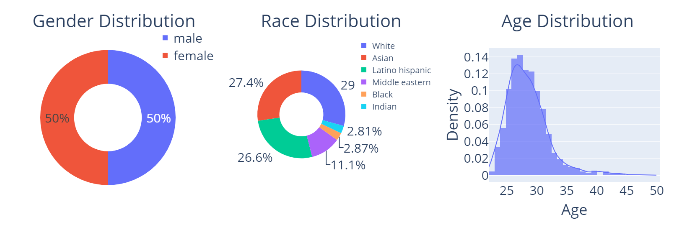

# eKYC-DF: A Large-Scale Deepfake Dataset for Developing and Evaluating eKYC Systems

#### Authors: [HICHEM FELOUAT](https://github.com/hichemfelouat), HUY H. NGUYEN, TRUNG-NGHIA LE, JUNICHI YAMAGISHI, and ISAO ECHIZEN
------------------------------------------------------------

Examples of face-swapping results generated by SimSwap, FaceDancer, and SberSwap.

Distribution of subjects in eKYC-DF dataset across age, gender,
and ethnicity. The dataset is balanced in terms of gender and has high
diversity in terms of age and ethnicity. These statistics were calculated
using Facebook’s [DeepFace](https://github.com/serengil/deepface) Software.

## Project Overview

The reliability of remote identity-proofing systems (\textit{i.e.}, electronic Know Your Customer, or eKYC, systems) is challenged by the development of deepfake generation tools, which can be used to create fake videos that are difficult to detect using existing deepfake detection models and are indistinguishable by facial recognition systems. This poses a serious threat to eKYC systems and a danger to individuals' personal information and property. Existing deepfake datasets are not particularly appropriate for developing and evaluating eKYC systems, which require specific motions, such as head movement, for liveness detection. Furthermore, they do not contain ID information or protocols for facial verification evaluation, which is vital for eKYC. We found that eKYC systems without the ability to detect deepfakes can be easily compromised. We have thus created a large-scale collection of high-quality fake videos (more than 228,000 videos) that are diverse in terms of age, gender, and ethnicity, plus a corresponding facial image subset. The videos include a variety of head movements and facial expressions. This large collection of high-quality diverse videos is well-suited for developing and evaluating various tasks related to eKYC systems. Furthermore, we provide protocols for traditional deepfake detection and facial verification, which are widely used in eKYC systems. It is worth mentioning that systematic evaluation of facial recognition systems on deepfake detection has not been reported.

## Usage

Coming soon!

## Citation

Please cite this dataset as follows:

## Contact

For inquiries or feedback, please get in touch with us at:

(hichemfel@gmail.com, hichemfel@nii.ac.jp)

